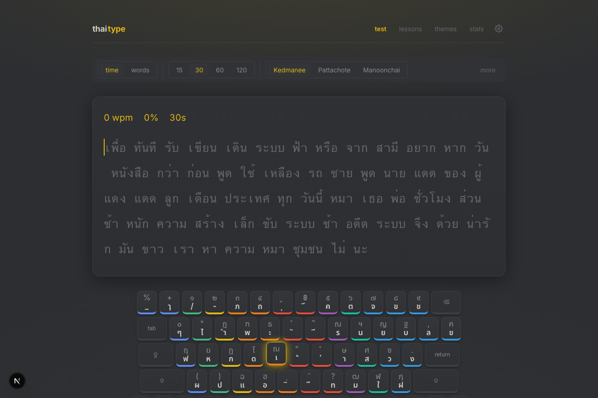
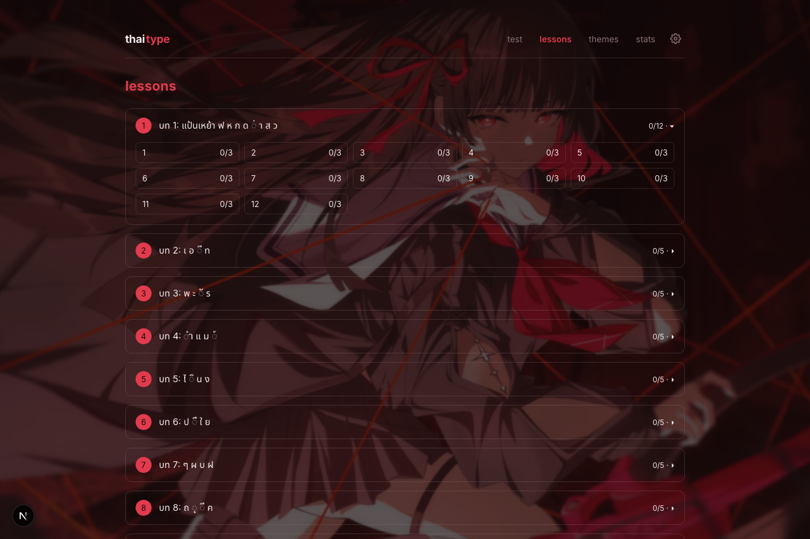
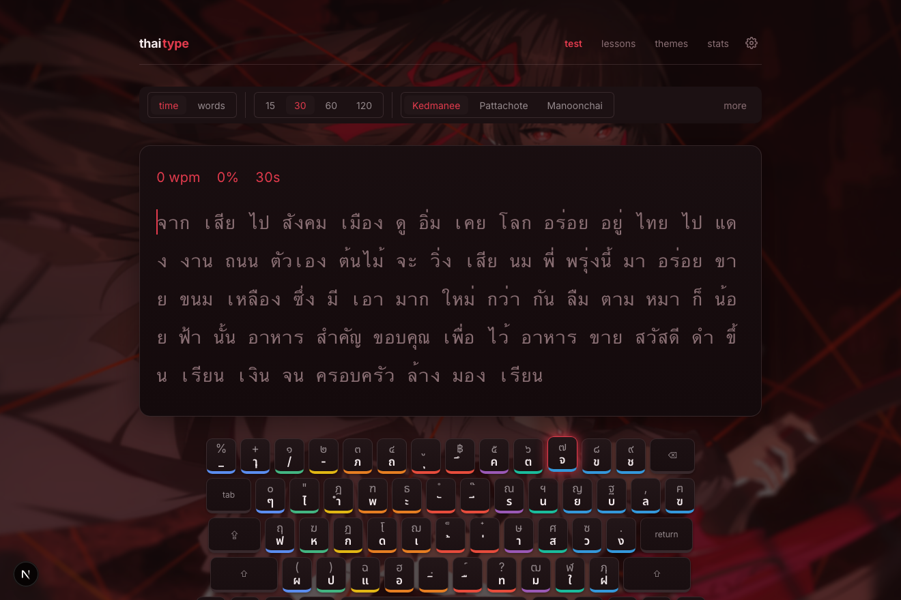

# thai-type

[English](./README.md) · **ไทย**

โปรแกรมฝึกพิมพ์สัมผัสภาษาไทยในสไตล์ Monkeytype — มีบทเรียนเป็นลำดับขั้น รองรับผังแป้นพิมพ์หลายแบบ แสดงสถิติแบบเรียลไทม์ และปรับแต่ง/เปลี่ยนธีมได้อย่างละเอียด ออกแบบมาเพื่อเรียนพิมพ์แป้นภาษาไทยตั้งแต่แถวเหย้าเป็นต้นไป

**▶ ทดลองใช้งาน: <https://ntplsrpp.github.io/thai-type/>**



> ทุกอย่างทำงานฝั่งเบราว์เซอร์ทั้งหมด ความคืบหน้าและการตั้งค่าถูกบันทึกไว้ในเบราว์เซอร์ (ไม่มีเซิร์ฟเวอร์ ไม่ต้องสมัครบัญชี)

## ฟีเจอร์

- **เอนจินการพิมพ์** — เปรียบเทียบทีละอักขระ (code point) แต่แสดงผลแบบรวมกลุ่มพยางค์ด้วย `Intl.Segmenter` ทำให้สระ/วรรณยุกต์ของไทยแสดงติดกับพยัญชนะฐาน ขณะที่ยังตรวจถูก/ผิดเป็นรายปุ่ม
- **บทเรียน** — นำหลักสูตรทั้งหมดจาก [typingth.com](https://www.typingth.com) มาจัดเป็นบท → บทย่อย แต่ละบทย่อยต้องพิมพ์ซ้ำให้ครบ 3 รอบจึงจะผ่าน ข้ามไปบทใดก็ได้ กด <kbd>space</kbd> ไปบทถัดไป กด <kbd>r</kbd> เริ่มใหม่
- **โหมดทดสอบ** — โหมดจับเวลาและโหมดนับจำนวนคำ พร้อมแสดง WPM / ความแม่นยำแบบเรียลไทม์ สไตล์ Monkeytype
- **ผังแป้นพิมพ์** — เกษมณี (Kedmanee), ปัตตโชติ (Pattachote) และ มนูญชัย (Manoonchai) พร้อมโซนนิ้วที่ถูกต้องในแต่ละปุ่ม
- **แป้นพิมพ์บนจอ** — แป้นแบบ MacBook เต็มรูปแบบ แสดงอักขระชั้น Shift, ระบายสีตามโซนนิ้ว, ไฮไลต์ปุ่มถัดไป และ heatmap จุดที่พิมพ์ผิดบ่อย ปรับขนาดได้ 3 ระดับ
- **ธีม** — ธีมสำเร็จรูป 14 แบบ และสร้างธีมเองได้ (กำหนดจานสี รูปแบบเคอร์เซอร์ และอัปโหลดภาพพื้นหลังที่เก็บไว้ใน IndexedDB)
- **การตั้งค่า** — หยุดเมื่อพิมพ์ผิด, ห้ามลบย้อนหลัง, โหมดปิดตา (blind), รูปแบบเคอร์เซอร์, เคอร์เซอร์ลื่นไหล, ฟอนต์ + ขนาด, ความกว้างหน้า, เสียง และอื่น ๆ — บันทึกลง `localStorage` พร้อมการย้ายเวอร์ชันสคีมา

## ภาพหน้าจอ

| บทเรียน | ธีม |
|---|---|
| [](docs/screenshots/lessons.png) | [](docs/screenshots/theme-chisa.png) |

## เทคโนโลยีที่ใช้

- **Next.js 16** (App Router, Turbopack) · **React 19** · **TypeScript**
- **Zustand** จัดการสถานะ · `localStorage` + **IndexedDB** (`idb-keyval`) สำหรับบันทึกข้อมูล
- **Vitest** + **@testing-library/react** (unit/component) · **Playwright** (e2e)
- ฟอนต์ผ่าน `next/font` (Inter สำหรับ UI, Noto Sans Thai สำหรับการพิมพ์)

## เริ่มต้นใช้งาน

ต้องใช้ Node 20+ (พัฒนาบน Node 22)

```bash
npm install
npm run dev
```

เปิด <http://localhost:3000>

## คำสั่ง (scripts)

| คำสั่ง | ทำอะไร |
|---|---|
| `npm run dev` | เซิร์ฟเวอร์สำหรับพัฒนา (Turbopack) |
| `npm run build` | บิลด์สำหรับใช้งานจริง |
| `npm start` | รันไฟล์ที่บิลด์แล้ว |
| `npm run lint` | ตรวจโค้ดด้วย ESLint |
| `npm test` | เทสต์ unit + component (Vitest) |
| `npm run test:watch` | Vitest โหมด watch |
| `npm run e2e` | เทสต์แบบ end-to-end (Playwright) |

## โครงสร้างโปรเจกต์

```
app/            เส้นทาง: / (ทดสอบ), /lessons, /lessons/[id], /themes, /stats, /settings
components/     UI — Keyboard, Words, SubLessonRunner, TestScreen, SettingsPanel, …
lib/
  engine/       เอนจินการพิมพ์, เมตริก, สถิติรายปุ่ม
  layouts/      เกษมณี / ปัตตโชติ / มนูญชัย + การแปลงปุ่ม→อักขระ
  curriculum/   บทและบทย่อยจาก typingth
  theme/        ธีมสำเร็จรูป, ชนิดข้อมูลธีม, ตัวปรับใช้
  storage/      สคีมาการตั้งค่า, การบันทึกแบบมีเวอร์ชัน
stores/         Zustand stores (การตั้งค่า, สถิติ, โมเดลปุ่ม, ความคืบหน้าบทเรียน)
tests/          เทสต์ unit + component (Vitest)
e2e/            เทสต์ Playwright
```

## การทดสอบ

```bash
npm test     # Vitest — เอนจิน, ผังแป้น, หลักสูตร, stores, คอมโพเนนต์
npm run e2e  # Playwright — บทเรียน, สลับผังแป้น, ธีม, สถิติ
```

## หมายเหตุ

- ภาพวอลเปเปอร์ที่แนบมา (`public/themes/`) และ URL วอลเปเปอร์ระยะไกลหนึ่งรายการ เป็นภาพของบุคคลที่สามที่ใช้กับธีม Hatsune Miku / Chisa หากจะเผยแพร่ต่อ ควรเปลี่ยนเป็นภาพของคุณเอง
- นี่ไม่ใช่ Next.js แบบที่คุณอาจคุ้นเคย โปรเจกต์นี้ใช้ Next 16 ก่อนแก้โค้ดส่วนเฟรมเวิร์ก ให้ดู `node_modules/next/dist/docs/` สำหรับ API เฉพาะเวอร์ชัน

## สัญญาอนุญาต

[MIT](./LICENSE) © NTPLSRPP — สัญญาอนุญาต MIT ครอบคลุมเฉพาะซอร์สโค้ดของโปรเจกต์นี้ ส่วนภาพวอลเปเปอร์ของบุคคลที่สาม (ดูหัวข้อหมายเหตุ) ไม่อยู่ในสัญญานี้ และยังเป็นลิขสิทธิ์ของเจ้าของผลงานเดิม
